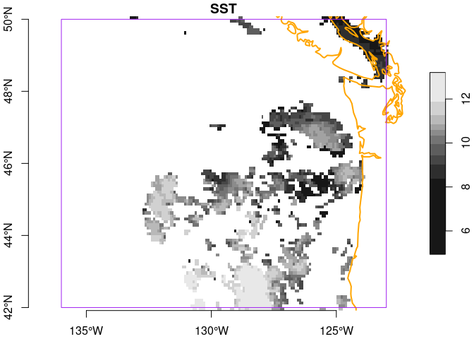
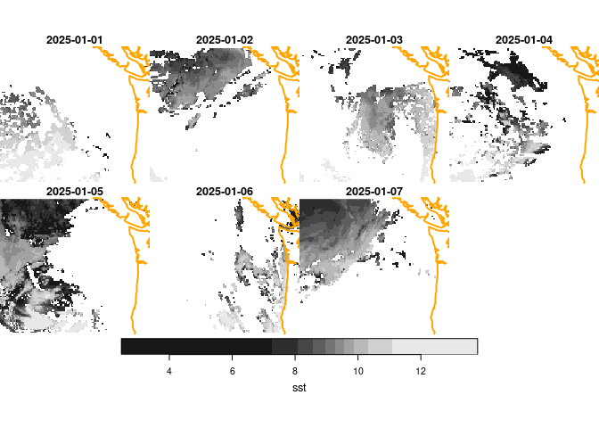

obpg
================

Access OPeNDAP [OBPG](https://oceancolor.gsfc.nasa.gov/) data from R.

This package provides simple tools for accessing most of the offerings
found [here](https://oceandata.sci.gsfc.nasa.gov/opendap/). This package
leverages OBPG’s excellent filename standards with some assumptions
about the organizational heirarchy on the server-side. If you need a
more robust solution then consider using the
[thredds](https://github.com/BigelowLab/thredds) package to navigate the
catalog. Use `thredds` to navigate the server catalog to find your
desired product, then you can use this package to open the product as an
OPeNDAP resource.

## Requirements

- [R v4.1+](https://www.r-project.org/)

Packages from CRAN:

- [rlang](https://CRAN.R-project.org/package=rlang)
- [httr](https://CRAN.R-project.org/package=httr)
- [readr](https://CRAN.R-project.org/package=readr)
- [dplyr](https://CRAN.R-project.org/package=dplyr)
- [sf](https://CRAN.R-project.org/package=sf)
- [stars](https://CRAN.R-project.org/package=stars)
- [tidync](https://CRAN.R-project.org/package=ncdf4)

## Installation

    remotes::install_github("BigelowLab/obpg")

### Usage

This package provides utilties for the following…

- Generate URLs for products

- Open the OPeNDAP product resources and query the contents as a
  [tidync](https://github.com/ropensci/tidync) object.

- Extract the data in whole or part (rectangular subset) as a
  [stars](https://r-spatial.github.io/stars/) object

- Archive files (as GeoTIFF) in an informal database arrangement

``` r
suppressPackageStartupMessages({
  library(rnaturalearth)
  library(dplyr)
  library(sf)
  library(stars)
  library(obpg)
})
```

# Generate a URL

Generate a URL for a data product with `obpg_url()` which accepts a
number of arguments specifying the mission, instrument date, period,
resolution and the like. It produces a table with three variables:

- `meta` the url of the user interface to the metadata

- `opendap` the url for the OPeNDAP resource

- `error` a logical based upon the existence of the `meta` page. If
  FALSE no error was encountered.

There are two rows, one for NRT (near real time) and one for
post-processed. When data is first posted it is likely to have the “NRT”
flag embedded in its filename. We prepopulate these to make downloading
easier.

``` r
url = obpg_url(date = "2024-12-18",
               mission = "SNPP", 
               instrument = "VIIRS",
               product = "SST.sst",
               period = "DAY",
               resolution = "9km")
url
```

    ## # A tibble: 2 × 3
    ##   meta                                                             opendap error
    ##   <chr>                                                            <chr>   <lgl>
    ## 1 https://oceandata.sci.gsfc.nasa.gov/opendap/VIIRS/L3SMI/2024/12… http:/… FALSE
    ## 2 https://oceandata.sci.gsfc.nasa.gov/opendap/VIIRS/L3SMI/2024/12… http:/… FALSE

OBPG filenames are highly descriptive. For instance, if we print the
basename of the first `opendap` element:
<http://oceandata.sci.gsfc.nasa.gov/opendap/VIIRS/L3SMI/2024/1218/SNPP_VIIRS.20241218.L3m.DAY.SST.sst.9km.nc>.
That file name encodes the event date, the resolution, the product name
and suite name, as well as info about the instrument platform flying
around in orbit.

# Open a connection

Simply pass the `url` table (above) to`open_obpg()` to open a
connection. This is at heart a
[tidync](https://github.com/ropensci/tidync) with one small
augmentation. If you are not familiar with
[tidync](https://github.com/ropensci/tidync) objects - worry not as you
don’t even have to look at it!

``` r
x = open_obpg(url)
```

Attached as an attribute to the object is a tiny table that represents a
decomposition of the base filename into constituent parts.

``` r
db = attr(x, "db") |> 
  print()
```

    ## # A tibble: 1 × 11
    ##   date       year  mmdd  mit        lvl   per   suite param res   nrt   file    
    ##   <date>     <chr> <chr> <chr>      <chr> <chr> <chr> <chr> <chr> <chr> <chr>   
    ## 1 2024-12-18 2024  1218  SNPP_VIIRS L3m   DAY   SST   sst   9km   <NA>  SNPP_VI…

# Crop to a subset

Next we can crop to a subset of the resource by providing a bounding
box. Cropping is non-destructive - you can always later crop the same
object using a different bounding box. We provide an example bounding
box for the Pacific Northwest.

``` r
bb = pnw_bb()
x = crop_obpg(x, bb)
```

# Extract as `stars`

Finally, we can extract a `stars` array.

``` r
coast = rnaturalearth::ne_coastline(scale = "medium", returnclass = "sf") |>
  sf::st_geometry()
y = as_stars(x)
plot(y, axes = TRUE, main = db$suite, reset = FALSE)
plot(coast, col = "orange", lwd = 2, add = TRUE)
```

<!-- -->

# Fetching data and saving images

We provide a toolset for downloading and organizing a database of files.
Consider downloading a time series for one particular product. You need
to provide a root directory into which the data will be stored. We’ll
make in your home directory, and we’ll add a subdirectory structure to
that. Note that we include region, instrument and level as diretcory
segments. That allows you to store other types of products along side.

``` r
root = "~/obpg_data/pnw/SNPP_VIRRS/L3m"
ok = make_path(root)
```

Next we make a series of dates, and the iterate over a series of
fetches. Each call to `fetch_obpg()` returns the small database (if
successful), which we then bind into one table and save.

``` r
dates = seq(from = as.Date("2025-01-01"), length = 7, by = "day")
db = lapply(dates,
            function(date){
              cat("working on", format(date, "%Y-%m-%d"), "\n")
              url = url = obpg_url(date = date,
                mission = "SNPP", 
                instrument = "VIIRS",
                product = "SST.sst",
                period = "DAY",
                resolution = "9km")
              dbase = fetch_obpg(url, bb = bb, path = root)
              return(dbase)
            }) |>
  dplyr::bind_rows() |>
  write_database(root)
```

    ## working on 2025-01-01 
    ## working on 2025-01-02 
    ## working on 2025-01-03 
    ## working on 2025-01-04 
    ## working on 2025-01-05 
    ## working on 2025-01-06 
    ## working on 2025-01-07

``` r
print(db)
```

    ## # A tibble: 7 × 11
    ##   date       year  mmdd  mit        lvl   per   suite param res   nrt   file    
    ##   <date>     <chr> <chr> <chr>      <chr> <chr> <chr> <chr> <chr> <chr> <chr>   
    ## 1 2025-01-01 2025  0101  SNPP_VIIRS L3m   DAY   SST   sst   9km   NRT   SNPP_VI…
    ## 2 2025-01-02 2025  0102  SNPP_VIIRS L3m   DAY   SST   sst   9km   NRT   SNPP_VI…
    ## 3 2025-01-03 2025  0103  SNPP_VIIRS L3m   DAY   SST   sst   9km   NRT   SNPP_VI…
    ## 4 2025-01-04 2025  0104  SNPP_VIIRS L3m   DAY   SST   sst   9km   NRT   SNPP_VI…
    ## 5 2025-01-05 2025  0105  SNPP_VIIRS L3m   DAY   SST   sst   9km   NRT   SNPP_VI…
    ## 6 2025-01-06 2025  0106  SNPP_VIIRS L3m   DAY   SST   sst   9km   NRT   SNPP_VI…
    ## 7 2025-01-07 2025  0107  SNPP_VIIRS L3m   DAY   SST   sst   9km   NRT   SNPP_VI…

# Read files form a filtered database

Finally, you can read in one or more files as stars objects.

``` r
filenames  = compose_filename(db, root)
x = stars::read_stars(filenames, along = list(time = db$date))
x
```

    ## stars object with 3 dimensions and 1 attribute
    ## attribute(s):
    ##                                 Min. 1st Qu. Median     Mean 3rd Qu.  Max.
    ## SNPP_VIIRS.20250101.L3m.DAY...  2.48    8.67  9.525 9.484838   10.46 13.72
    ##                                  NA's
    ## SNPP_VIIRS.20250101.L3m.DAY...  78322
    ## dimension(s):
    ##      from  to     offset    delta refsys point x/y
    ## x       1 156       -136  0.08333 WGS 84 FALSE [x]
    ## y       1  96         50 -0.08333 WGS 84 FALSE [y]
    ## time    1   7 2025-01-01   1 days   Date    NA

And plot…

``` r
coast_plot = function(){
  plot(coast, col = "orange", lwd = 2, add = TRUE)
}
plot(x, hook = coast_plot)
```

<!-- -->
